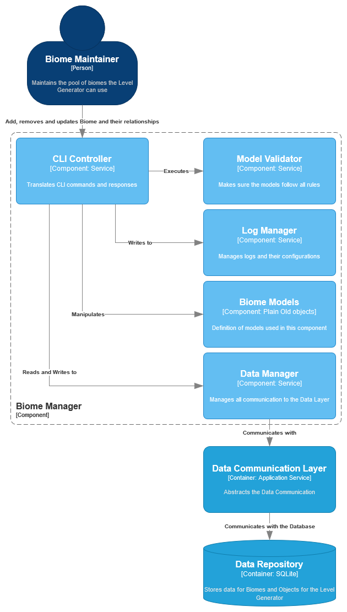

| [Container](container.md) | [Component: Object Manager](component_object.md) |
| ------------------------- | ------------------------------------------------ |

# Biome Manager

## Breakdown

This `Component` enables [CRUD operations](https://en.wikipedia.org/wiki/Create,_read,_update_and_delete) for [biome](../requirements/definitions/biome_definition.md) data.

It must be accessible via a [Command Line Interface](https://en.wikipedia.org/wiki/Command-line_interface).

## Index

1. [•](#cli-controller) CLI Controller
1. [•](#model-validator) Model Validator
1. [•](#log-manager) Log Manager
1. [•](#biome-models) `Biome` Models
1. [•](#data-manager) Data Manager

## CLI Controller

Responsible for all `CLI` communications.

Must interpret user input as well as provide useful output in a `CLI-friendly` format.

## Model Validator

Makes sure all `Biome` data is valid as specified in the [documentation](../requirements/definitions/biome_definition.md).

`Models` are received via the service `caller`.

If the `model` is not valid, an `error` must be sent back and operations must end.

The `error` must contain all necessary information needed to have it identified and fixed by the `caller`.

## Log Manager

Allows the `Component` to write log messages during execution.

This is very important for debugging and making sure the application is running correctly.

In order to make `logging` transparent to the `Component`, this `Manager` should maintain all configurations and issue `loggers` when requested.

## Biome Models

Contains the definitions of all the `models` used by this `Component`.

This must include:

- `Biome Model` definition
- `Affinity` definition
- `Biome` relationships

## Data Manager

Communicates with the `Data Communication Layer` in order to persist, retrieve or revome data.

This `manager` should handle only `biome` data exclusively.

#

| [Container](container.md) | [Component: Object Manager](component_object.md) |
| ------------------------- | ------------------------------------------------ |
