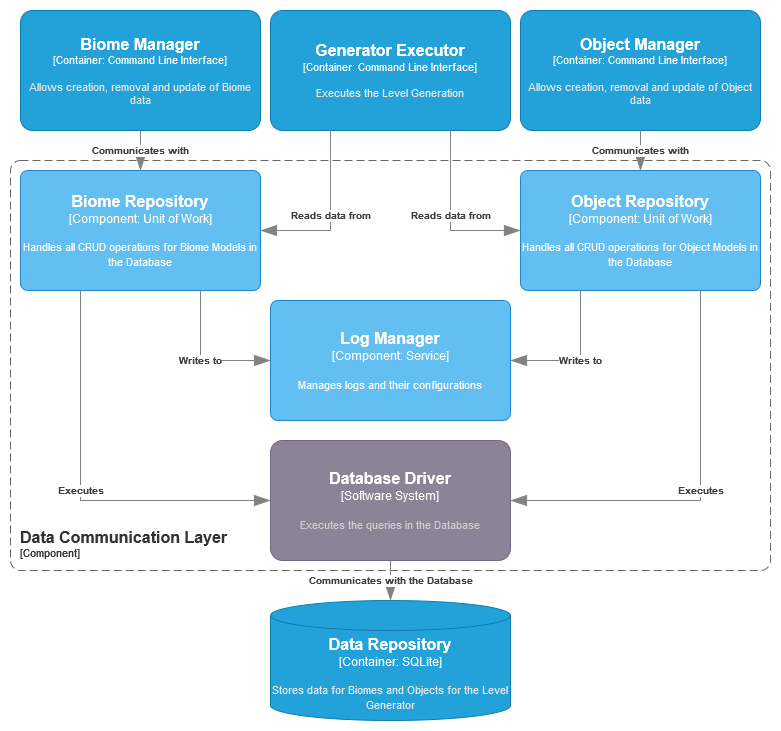

| [Component: Generator Executor](component_executor.md) |
| ------------------------------------------------------ |

# Data Communication Layer

## Breakdown

This `Component` implements all the necessary services needed in order to communicate with the database in order to store `biomes` and `objects`.

## Index

1. [•](#biome-repository) Biome Repository
1. [•](#object-repository) Object Repository
1. [•](#log-manager) Log Manager
1. [•](#database-driver) Database Driver

## Biome Repository

Should implement a [Unit of Work](https://martinfowler.com/eaaCatalog/unitOfWork.html) in order to manage [Biome](../requirements/definitions/biome_definition.md) data.

## Object Repository

Should implement a [Unit of Work](https://martinfowler.com/eaaCatalog/unitOfWork.html) in order to manage [Object](../requirements/definitions/object_definition.md) data.

## Log Manager

Allows the `Component` to write log messages during execution.

This is very important for debugging and making sure the application is running correctly.

In order to make `logging` transparent to the `Component`, this `Manager` should maintain all configurations and issue `loggers` when requested.

## Database Driver

External piece of software which allows the `Units of Work` to connect and execute commands in the `database`.

Since every `database` has their own definitions and constraints to acess and manage, each one also provides specific `drivers` to handle those especificities.

#

| [Component: Generator Executor](component_executor.md) |
| ------------------------------------------------------ |
