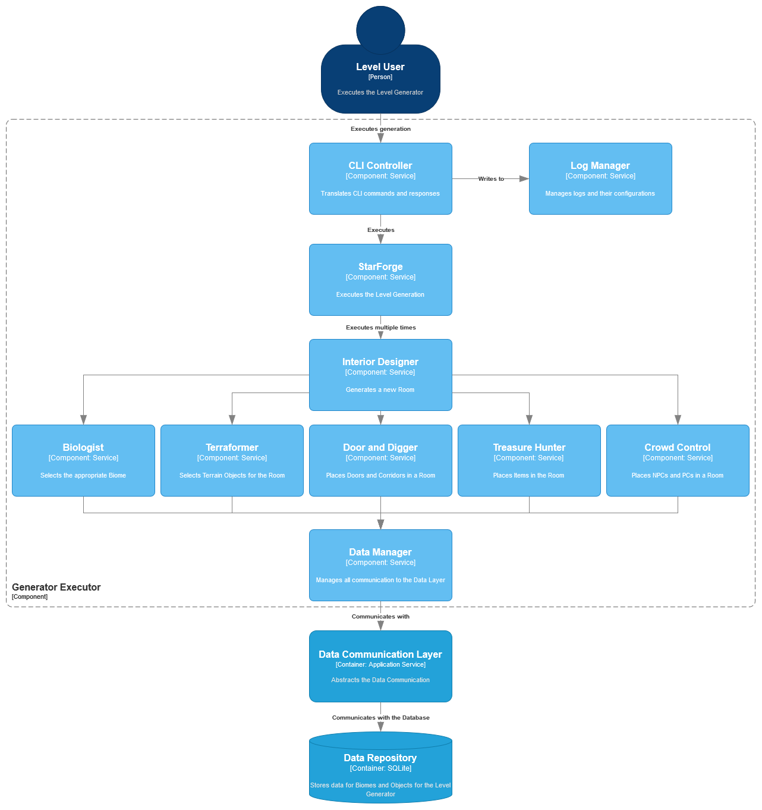

| [Component: Object Manager](component_object.md) | [Component: Data Communication Layer](component_data_layer.md) |
| ------------------------------------------------ | -------------------------------------------------------------- |

# Generator Executor

## Breakdown

This `Component` performs all the necessary steps for a level generation to take place.

It must be accessible via a [Command Line Interface](https://en.wikipedia.org/wiki/Command-line_interface).

## Index

1. [•](#cli-controller) CLI Controller
1. [•](#log-manager) Log Manager
1. [•](#starforge) StarForge
1. [•](#interior-designer) Interior Designer
1. [•](#biologist) Biologist
1. [•](#terraformer) Terraformer
1. [•](#door-and-digger) Door and Digger
1. [•](#treasure-hunter) Treasure Hunter
1. [•](#crowd-control) Crowd Control
1. [•](#data-manager) Data Manager

## CLI Controller

Responsible for all `CLI` communications.

Must interpret user input as well as provide useful output in a `CLI-friendly` format.

## Log Manager

Allows the `Component` to write log messages during execution.

This is very important for debugging and making sure the application is running correctly.

In order to make `logging` transparent to the `Component`, this `Manager` should maintain all configurations and issue `loggers` when requested.

## StarForge

Executes all the necessary steps to generate a [Level](../requirements/generation/levels.md).

This `Component` must execute and handle the result of all `sub-components` in order to have the final result complete.

It should also handle any errors that occur from the process.
Unrecoverable errors will halt the level generation and exit the process, with an appropriate response to the [CLI Controller](#cli-controller).

## Interior Designer

Generates a single [Room](../requirements/generation/rooms.md). Can be executed multiple times.

It will execute the necessary `sub-components` to gather all the necessary information about a `room`.

It should also handle any errors raised by the `sub-components`.
If the error is unrecoverable, it should be raised to the [StarForge](#starforge).

## Biologist

Responsible for selecting the [Biome](../requirements/definitions/biome_definition.md) for the current `Room` generation.

It should have access to the neighboring `rooms` in order to avoid conflicts and select a compatible `biome` to theirs.

## Terraformer

Selects the [Terrain objects](../requirements/generation/terrain.md) for the current `Room` generation.

More than one `object` may be selected but because of their constraints, not all may be used.

## Door and Digger

This `sub-component` must make sure the `room` has the appropriate `doors` and/or `corridors`, as per [spec](../requirements/generation/doors.md).

If no `door` or `corridor` can be placed, the `sub-component` must raise an error.

## Treasure Hunter

`Sub-component` responsible for placing the [items](../requirements/generation/items.md) in the `room`.

## Crowd Control

Places the [NPCs](../requirements/generation/npcs.md) in the `room`.

It should also make sure the [PC](../requirements/generation/players.md) is known.

## Data Manager

Communicates with the `Data Communication Layer` in order to persist, retrieve or revome data.

This `manager` should handle only `object` data exclusively.

#

| [Component: Object Manager](component_object.md) | [Component: Data Communication Layer](component_data_layer.md) |
| ------------------------------------------------ | -------------------------------------------------------------- |
