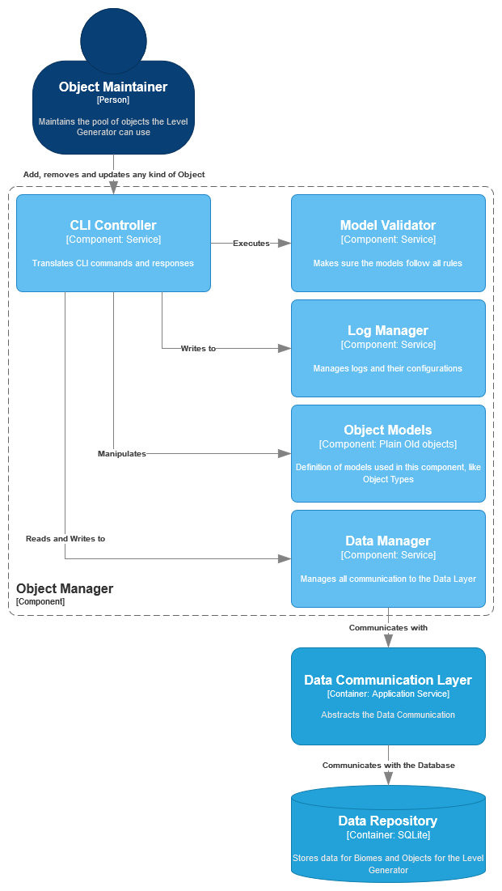

| [Biome Manager](component_biome.md) |
| ----------------------------------- |

# Object Manager

## Breakdown

This `Container` enables [CRUD operations](https://en.wikipedia.org/wiki/Create,_read,_update_and_delete) for [object](../requirements/definitions/object_definition.md) data.

It must be accessible via a [Command Line Interface](https://en.wikipedia.org/wiki/Command-line_interface).

## Index

1. [•](#cli-controller) CLI Controller
1. [•](#model-validator) Model Validator
1. [•](#log-manager) Log Manager
1. [•](#object-models) `Object` Models
1. [•](#data-manager) Data Manager

## CLI Controller

Responsible for all `CLI` communications.

Must interpret user input as well as provide useful output in a `CLI-friendly` format.

## Model Validator

Makes sure all `Object` data is valid as specified in the [documentation](../requirements/definitions/object_definition.md).

`Models` are received via the service `caller`.

If the `model` is not valid, an `error` must be sent back and operations must end.

The `error` must contain all necessary information needed to have it identified and fixed by the `caller`.

## Log Manager

Allows the `Component` to write log messages during execution.

This is very important for debugging and making sure the application is running correctly.

In order to make `logging` transparent to the `Component`, this `Manager` should maintain all configurations and issue `loggers` when requested.

## Object Models

Contains the definitions of all the `models` used by this `Component`.

This must include:

- [Object definition](../requirements/definitions/object_definition.md)
- [Object Type definition](../requirements/definitions/object_type_definition.md)

## Data Manager

Communicates with the `Data Communication Layer` in order to persist, retrieve or revome data.

This `manager` should handle only `object` data exclusively.

#

| [Biome Manager](component_biome.md) |
| ----------------------------------- |
