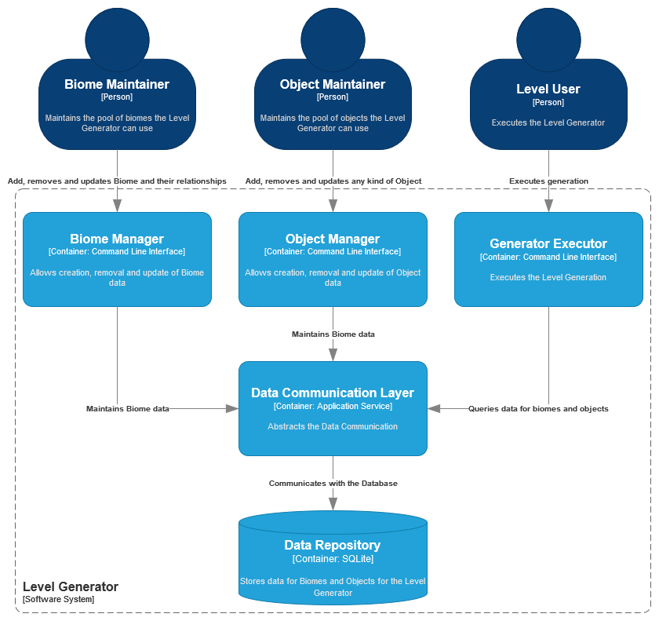

| [System Context](system.md) | [Biome Manager](component_biome.md) |
| --------------------------- | ----------------------------------- |

# Container

## Level Generator

The `Level Generator` is a `software system` and therefore can be defined as the interaction between different `containers`.

### Biome Manager Container

This `Container` is responsible for managing all [Biome](../requirements/definitions/biome_definition.md) data in the system.

It is detailed [here](component_biome.md).

### Object Manager Container

Accessible via a [Command Line Interface](https://en.wikipedia.org/wiki/Command-line_interface).

Enables [CRUD operations](https://en.wikipedia.org/wiki/Create,_read,_update_and_delete) for [object](../requirements/definitions/object_definition.md) data.

Should perform all validations according to the [especifications](../requirements/generation/rooms.md).

Errors should be returned to the `User` using `stderr`.

### Generator Executor Container

Accessible via a [Command Line Interface](https://en.wikipedia.org/wiki/Command-line_interface).

Must perform the execution according to the [especification](../requirements/generation/README.md), making sure to respect the ordering, validations and due process of the generation.

Errors should be returned to the `User` using `stderr`.

### Data Communication Layer Container

Abstracts the communication with the `Data Repository`.

This allows the other `containers` have less knowledge about the uderlying data storage, making them simpler and easier to use.

Errors must be validated and if unrecoverable, must throw specific `exceptions` to the caller.

This `container` cannot be executed directly by any `user`.

### Data Repository Container

Stores and manages data for the `Level Generator`.

It should handle the [CRUD](https://en.wikipedia.org/wiki/Create,_read,_update_and_delete) paradigm for the models.

#

| [System Context](system.md) | [Biome Manager](component_biome.md) |
| --------------------------- | ----------------------------------- |
