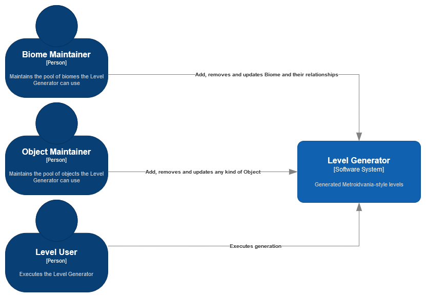

| [Architecture Overview](README.md) | [Container](container.md) |
| ---------------------------------- | ------------------------- |

# System Context

## Users

Based on the [requirements](../requirements/README.md) for the `Level Generator`, three different `users` were identified and are now described here.

### Biome Maintainer

`User` responsible for creating, removing and updating [biome](../requirements/definitions/biome_definition.md) information.

### Object Maintainer

`User` responsible for creating, removing and updating [object](../requirements/definitions/object_definition.md) information.

### Level User

`User` responsible for generating [levels](../requirements/definitions/level_definition.md) using the previously defined `biomes` and `objects`.

## Software System

### Level Generator

Implements the necessary [requirements](../requirements/README.md) in order to execute the generation of a `Level`.

#

| [Architecture Overview](README.md) | [Container](container.md) |
| ---------------------------------- | ------------------------- |
